# GitHub Actions CI/CD 配置说明

简化版 CI/CD 流水线，包含测试、构建、部署三个核心阶段。

## 🚀 流水线概览

### 触发条件
- `main` 分支推送 → 生产环境部署
- `develop` 分支推送 → 开发环境部署
- Pull Request → 仅运行测试
- 手动触发 → 完整流水线

### 流水线阶段

```mermaid
graph LR
    A[代码推送] --> B[测试]
    B --> C[构建镜像]
    C --> D[部署]
```



## 📋 阶段说明

### 1. 测试 (test)
**并行执行前端和后端测试**

- **前端测试**:
  - 类型检查 (`npm run type-check`)
  - ESLint 代码规范
  - 构建验证

- **后端测试**:
  - MyPy 类型检查
  - pytest 单元测试

### 2. 构建镜像 (build)
**仅在推送时执行，跳过 PR**

- 构建前端和后端 Docker 镜像
- 推送到 GitHub Container Registry
- 标签: `latest` 和 `{commit-sha}`

### 3. 部署 (deploy)
**根据分支自动选择环境**

- `main` 分支 → 生产环境
- `develop` 分支 → 开发环境
- 其他分支 → 跳过部署

## 🔧 使用方法

### 本地验证
```bash
# 验证 YAML 语法
python3 -c "import yaml; yaml.safe_load(open('.github/workflows/ci.yml'))"

# 本地测试
cd frontend && npm run type-check && npm run lint
cd backend && pip install -r requirements.txt && mypy app/
```

### 手动触发
在 GitHub Actions 页面点击 "Run workflow" 按钮

### 查看结果
- Actions 页面查看执行日志
- Packages 页面查看构建的镜像

## 📦 镜像命名

```
ghcr.io/{owner}/{repo}-backend:latest
ghcr.io/{owner}/{repo}-frontend:latest
ghcr.io/{owner}/{repo}-backend:{commit-sha}
ghcr.io/{owner}/{repo}-frontend:{commit-sha}
```

## 🔧 自定义部署

修改 `deploy` 步骤中的部署命令：

```yaml
# 示例：Docker Compose 部署
- name: Deploy to environment
  run: |
    # 更新 docker-compose.yml 中的镜像标签
    sed -i "s|image:.*-backend:.*|image: ${{ env.REGISTRY }}/${{ env.IMAGE_NAME }}-backend:${{ github.sha }}|" docker/docker-compose.prod.yml
    docker compose -f docker/docker-compose.prod.yml up -d
```

## 🚨 故障排除

1. **测试失败**: 检查代码语法和测试用例
2. **构建失败**: 验证 Dockerfile 和依赖
3. **部署失败**: 检查部署脚本和权限

简化后的流水线更易维护，执行速度更快，适合大多数项目需求。