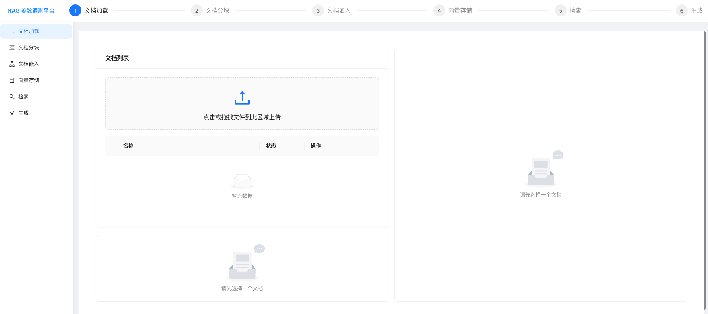
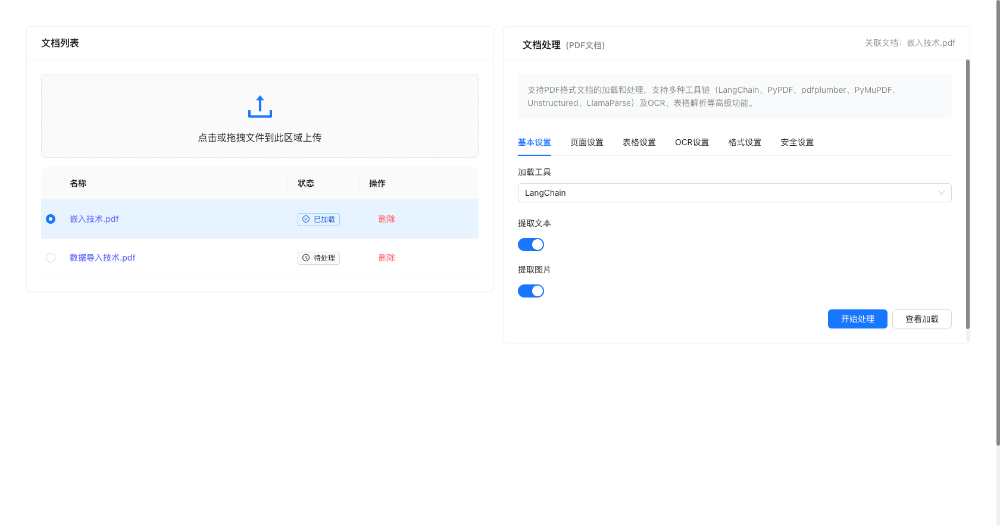
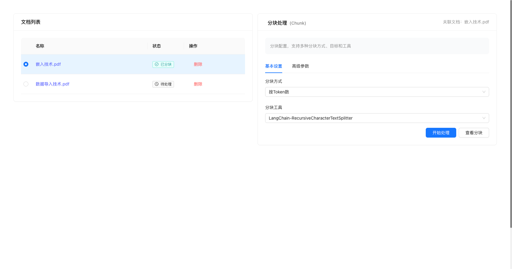
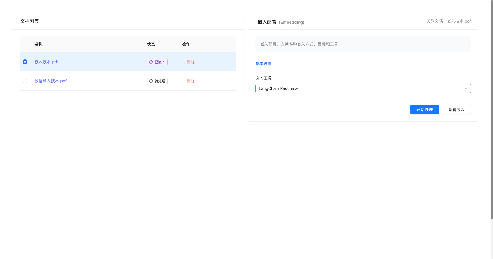
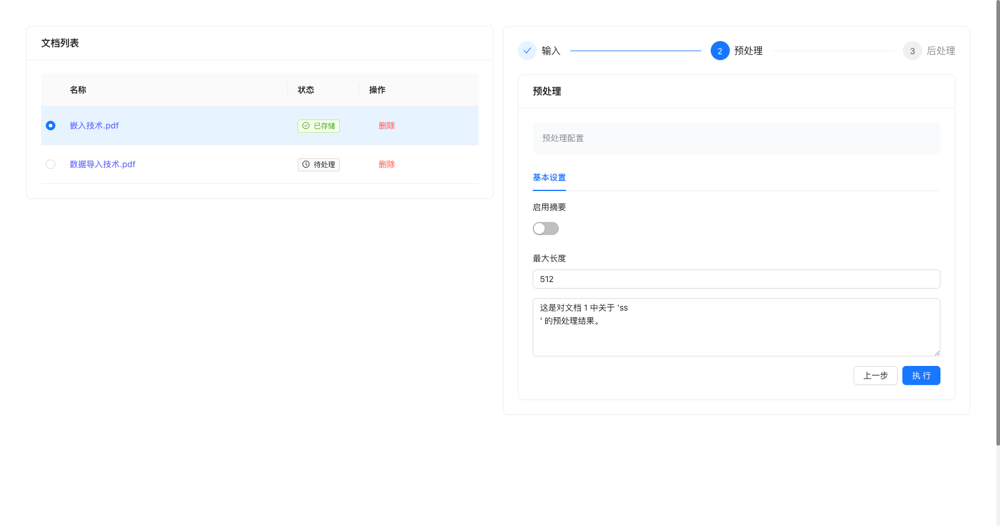
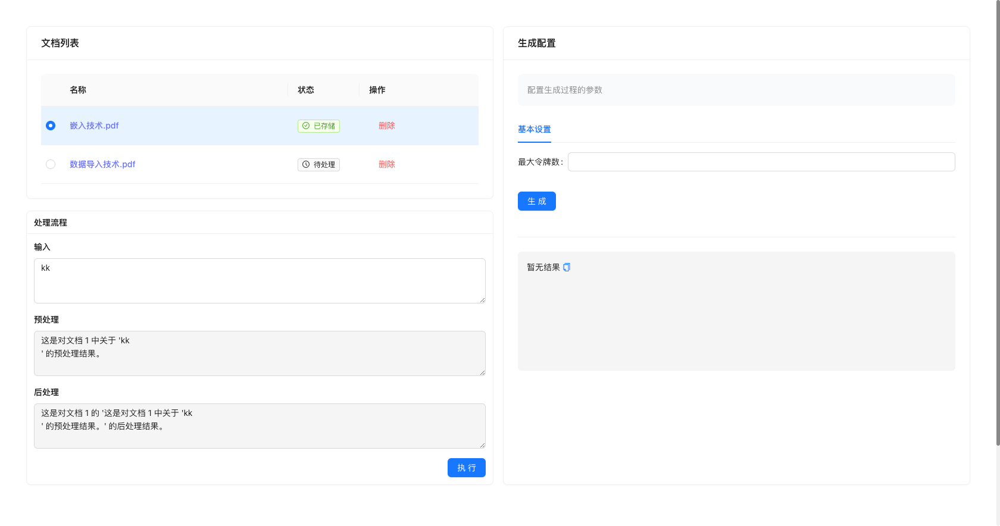
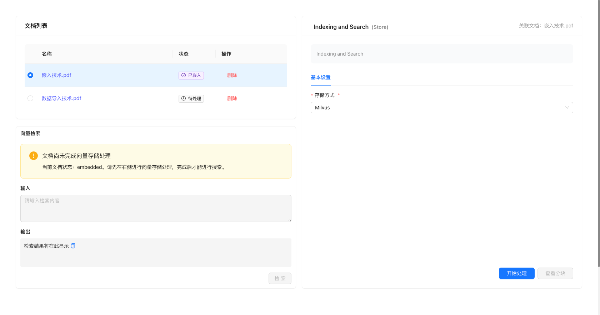

# RAG 参数调测平台

> 🚧 **开发中** - 一个用于 RAG（检索增强生成）系统参数调优的全栈平台

## 📸 功能展示

### 主界面概览


*完整的RAG参数调测平台界面，包含侧边栏导航和主要功能区域*

### 核心功能模块

#### 1. 文档加载管理


- 支持多种文档格式上传 (PDF, DOCX, TXT等)
- 文档预览和管理功能
- 批量处理和状态跟踪

#### 2. 文档分块配置


- 灵活的分块策略选择
- 可视化参数配置界面
- 实时预览分块效果

#### 3. 向量嵌入设置


- 多种嵌入模型支持
- 参数调优界面
- 嵌入效果预览

#### 4. 检索参数调优


- 相似度阈值设置
- Top-K 参数配置
- 检索策略选择

#### 5. 生成参数配置


- 温度、Max Tokens等参数调节
- Prompt模板管理
- 生成效果实时预览

#### 6. 向量存储管理


- 向量数据库配置
- 存储策略设置
- 性能监控

## 📋 项目状态

### ✅ 已完成功能
- 📄 **文档上传管理**：支持多种格式文档上传
- 🔧 **参数配置界面**：可视化的参数配置表单
- 🎨 **前端框架**：基于 React + TypeScript + Ant Design
- ⚙️ **后端框架**：基于 FastAPI + Python
- 🐳 **容器化部署**：Docker + Docker Compose 支持
- 🔄 **CI/CD 流水线**：自动化构建和部署

### 🚧 开发中功能 (TODO)

#### 1. 🔍 检索和生成后端接口
- [ ] 向量搜索接口实现
- [ ] 文档检索逻辑
- [ ] 生成结果接口
- [ ] 搜索结果排序和过滤

#### 2. 📊 参数配置功能实现
- [ ] 分块参数的实际处理逻辑
- [ ] 向量化参数的后端实现
- [ ] 搜索参数的功能对接
- [ ] 生成参数的模型调用

#### 3. 🤖 大模型集成
- [ ] 模型文件加载到镜像
- [ ] 本地模型推理服务
- [ ] 模型切换和配置
- [ ] 模型性能优化

#### 4. ⚙️ 设置页面完善
- [ ] 系统配置管理
- [ ] 用户偏好设置
- [ ] 模型配置界面
- [ ] 数据库连接配置

#### 5. 👤 用户管理系统
- [ ] 用户注册页面
- [ ] 用户登录页面
- [ ] 用户认证和授权
- [ ] 用户权限管理
- [ ] 个人资料管理
- [ ] 密码重置功能
- [ ] 会话管理和安全
- [ ] 用户活动日志

## 🛠️ 技术栈

### 后端
- **框架**：FastAPI
- **语言**：Python 3.11+
- **文档处理**：LangChain, LlamaIndex
- **向量数据库**：Milvus（计划）

### 前端
- **框架**：React 18 + TypeScript
- **构建工具**：Vite
- **UI 库**：Ant Design
- **状态管理**：Redux Toolkit

### DevOps
- **CI/CD**：GitHub Actions
- **容器化**：Docker + Docker Compose
- **镜像仓库**：GitHub Container Registry

## 🚀 快速开始

### 开发环境

#### 前置要求
- Node.js 18+
- Python 3.11+
- Docker & Docker Compose

#### 使用开发脚本

```bash
# 安装依赖
python scripts/dev.py install

# 启动开发环境（需要两个终端）
python scripts/dev.py dev-backend   # 终端 1: 后端服务
python scripts/dev.py dev-frontend  # 终端 2: 前端服务
```

### Docker 部署

```bash
# 开发环境
docker-compose up -d

# 访问地址
# 前端: http://localhost
# 后端: http://localhost:8000
# API 文档: http://localhost:8000/docs
```

## 📁 项目结构

```
rage/
├── backend/           # 后端服务
├── frontend/          # 前端应用
├── docker/            # Docker 配置文件
│   ├── docker-compose.yml      # 基础配置
│   └── docker-compose.dev.yml  # 开发环境
├── docs/              # 项目文档
│   ├── DEPLOYMENT.md           # 部署指南
│   ├── DEVELOPMENT.md          # 开发指南
│   ├── DOCKER_USAGE.md         # Docker 使用指南
│   ├── PROJECT_SUMMARY.md      # 项目概述
│   └── QUICKSTART.md           # 快速开始
├── scripts/           # 开发脚本
└── .github/           # GitHub 配置
    └── workflows/     # CI/CD 配置
```

## 🔧 开发工具

我们提供了跨平台的开发工具脚本：

```bash
# 查看所有可用命令
python scripts/dev.py help

# 常用命令
python scripts/dev.py install        # 安装依赖
python scripts/dev.py dev           # 显示开发说明
python scripts/dev.py build         # 构建项目
python scripts/dev.py test          # 运行测试
python scripts/dev.py docker-up     # Docker 部署
python scripts/dev.py status        # 检查状态
```

## 🤝 贡献指南

1. Fork 项目
2. 创建功能分支 (`git checkout -b feature/amazing-feature`)
3. 提交更改 (`git commit -m 'Add some amazing feature'`)
4. 推送到分支 (`git push origin feature/amazing-feature`)
5. 打开 Pull Request

## 📄 许可证

本项目采用 MIT 许可证 - 查看 [LICENSE](LICENSE) 文件了解详情。

## 🔗 相关文档

- [Docker 使用指南](docs/DOCKER_USAGE.md)
- [开发环境配置](docs/DEVELOPMENT.md)
- [部署指南](docs/DEPLOYMENT.md)
- [快速开始](docs/QUICKSTART.md)